# Lucrarea de Laborator Nr. 5 — Securitatea WordPress

**Student: Semeniuc Dănuța** 
**Grupa: I2301**   
**Profesor: Nartea Nichita, asist. univ** 

---

## 1. Scopul lucrării

Scopul acestei lucrări de laborator este consolidarea celor mai importante practici de securitate în WordPress, prin:

- Gestionarea corectă a rolurilor de utilizatori și a parolelor
- Efectuarea actualizărilor la timp pentru nucleu, teme și pluginuri
- Aplicarea tehnicilor de hardening de bază (`wp-config.php`, permisiuni de fișiere, dezactivarea editorului intern)
- Configurarea soluției **All In One WP Security & Firewall (AIOS)** pentru protecție împotriva atacurilor brute-force, WAF de bază și controlul permisiunilor
- Realizarea și testarea unui backup complet al site-ului WordPress

---

## 2. Pasul 1 — Pregătirea mediului

### 2.1 Accesul la panoul de administrare

Instalarea locală WordPress a fost realizată prin intermediul **XAMPP** (Apache + MySQL + PHP). Site-ul este accesibil la adresa `http://localhost/`, iar panoul de administrare la `http://localhost/wp-admin`.

Autentificarea s-a realizat cu contul de administrator creat la instalare.

### 2.2 Activarea modului de depanare

Fișierul `wp-config.php` a fost deschis din directorul rădăcină al instalării WordPress (`C:\xampp\htdocs\`). A fost adăugată următoarea linie înainte de comentariul `/* That's all, stop editing! */`:

```php
define('WP_DEBUG', true);
```

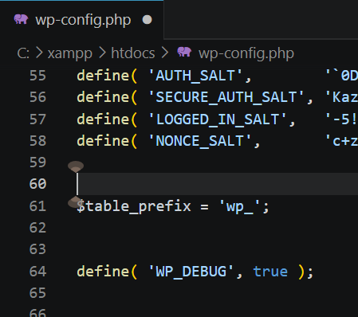

*Figura 1. Fișierul wp-config.php cu constanta WP_DEBUG setată la true*

> [!NOTE]
> 
> Modul de depanare (`WP_DEBUG`) afișează toate erorile PHP, avertismentele și notificările în timpul dezvoltării. Pe un site de producție, această opțiune trebuie dezactivată (`false`).

---

## 3. Pasul 2 - Gestionarea rolurilor și parolelor

### 3.1 Crearea unui utilizator de test cu rolul Autor

Din panoul de administrare, s-a navigat la **Utilizatori → Adaugă utilizator nou**. Au fost completate câmpurile formularului:

| Câmp | Valoare |
|------|---------|
| Nume utilizator | `autor_test` |
| Email | `autor_test@localhost.com` |
| Prenume | Test |
| Nume | Autor |
| Rol | **Autor** |
| Parolă | Generată automat (complexă) |


*Figura 2. Formularul de adăugare utilizator nou cu rolul Autor selectat*

Utilizatorul a fost salvat prin apăsarea butonului **Adaugă utilizator nou**.

### 3.2 Lista utilizatorilor cu rolurile atribuite

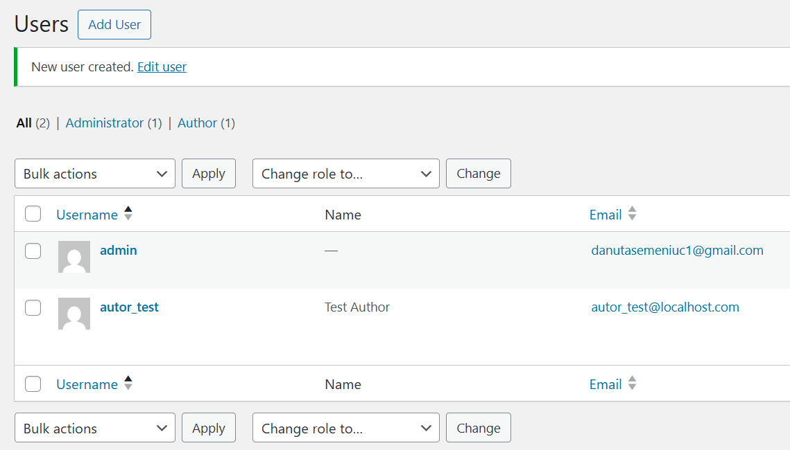

*Figura 3. Lista utilizatorilor — Administrator și Autor vizibili*

> **De ce rolul Autor?** Conform principiului celor mai mici privilegii, utilizatorul cu rolul „Autor" poate crea și gestiona **doar propriile articole**, fără acces la setările site-ului, pluginuri sau alți utilizatori.

### 3.3 Verificarea parolelor administratorilor

A fost generată o parolă nouă, complexă, folosind generatorul integrat WordPress (minim 12 caractere, combinând litere mari, litere mici, cifre și simboluri speciale).

---

## 4. Pasul 3 — Actualizări ale nucleului, temelor și pluginurilor

### 4.1 Verificarea actualizărilor disponibile

Din panoul de administrare, s-a navigat la **Consolă → Actualizări**.

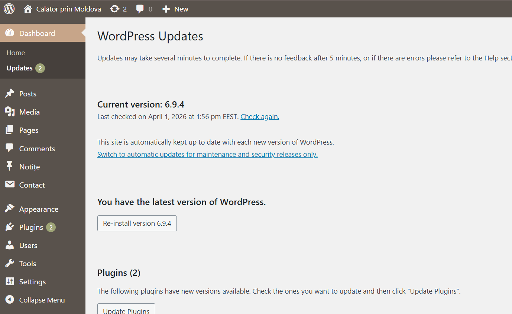

*Figura 4. Pagina Actualizări — componente disponibile pentru actualizare*

### 4.2 Rezultatul actualizărilor

Toate componentele au fost actualizate în ordinea recomandată: nucleul WordPress, temele, pluginurile.

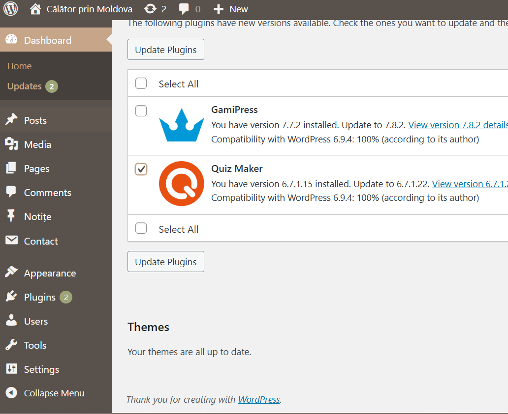

*Figura 5. Pagina Actualizări după finalizare — toate componentele sunt la zi*

> **De ce actualizările sunt esențiale?** Versiunile noi conțin patch-uri pentru vulnerabilități recent descoperite. Atacatorii scanează activ site-urile cu versiuni vechi, deci actualizarea promptă este una dintre cele mai eficiente măsuri de protecție.

---

## 5. Pasul 4 — Hardening de bază

### 5.1 Dezactivarea editării fișierelor din panoul de administrare

A fost adăugată în `wp-config.php` următoarea constantă:

```php
define('DISALLOW_FILE_EDIT', true);
```

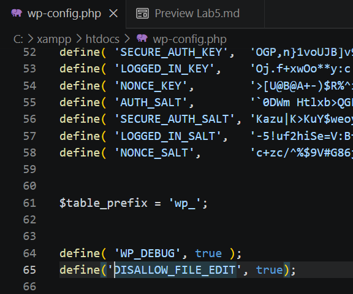

*Figura 6. Fișierul wp-config.php cu constantele de securitate adăugate*

**Verificarea efectului:** Meniurile „Editor temă" și „Editor plugin" au dispărut din panoul de administrare.

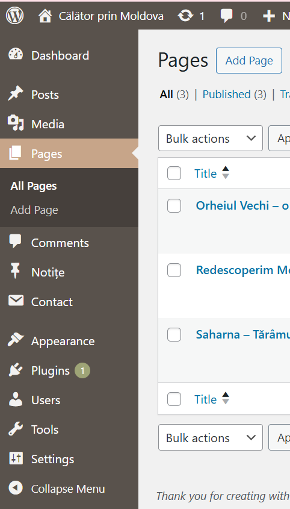

*Figura 7. Meniul Aspect — opțiunile de editor au dispărut după activarea DISALLOW_FILE_EDIT*

> **De ce este important?** Chiar dacă un atacator obține acces de admin, nu poate insera cod malițios în fișierele temei sau ale pluginurilor prin interfața web. Ar necesita acces FTP/SSH — un nivel mult mai ridicat de compromitere.

### 5.2 Protejarea fișierului wp-config.php prin .htaccess

Fișierul `.htaccess` din rădăcina site-ului a fost modificat cu blocul următor:

```apache
<Files "wp-config.php">
    Require all denied
</Files>
```

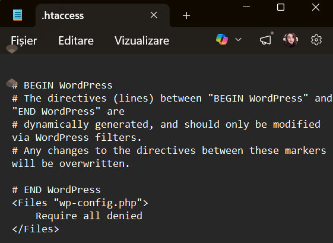

*Figura 8. Fișierul .htaccess cu regula de blocare a accesului la wp-config.php*

**Rezultat:** Orice cerere HTTP directă către `wp-config.php` returnează eroarea **403 Forbidden**.

---

## 6. Pasul 5 — Instalarea și configurarea AIOS

### 6.1 Instalarea pluginului

Din panoul de administrare, s-a navigat la **Pluginuri → Adaugă nou**, a fost căutat `All In One WP Security & Firewall`, instalat și activat.

### 6.2 Dashboard-ul AIOS — Scorul de securitate inițial

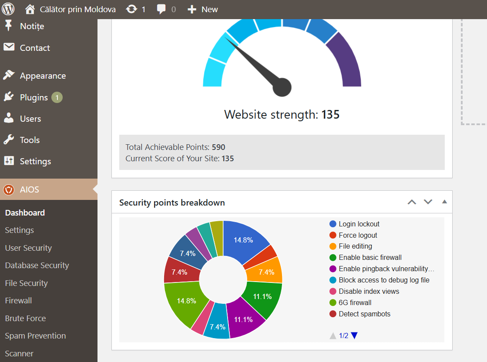

*Figura 9. Dashboard-ul AIOS cu scorul de securitate inițial (înainte de configurare)*

### 6.3 User Security — Login Lockdown

Navigat la: **WP Security → User Security → Login Lockdown**


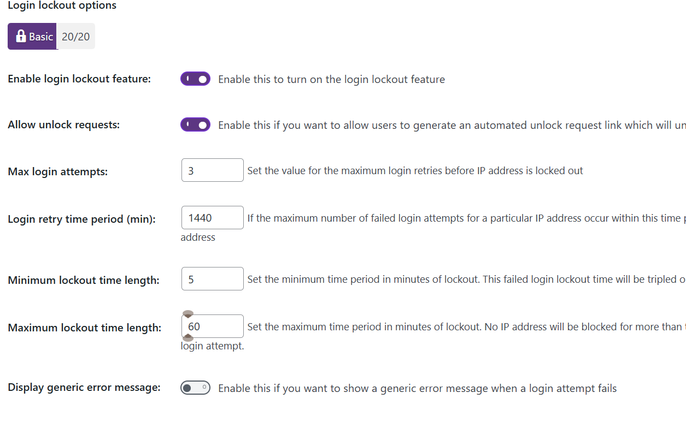

*Figura 10. Configurarea Login Lockdown în AIOS*

**Force Logout:** Activat cu timeout de **o oră** pentru a elimina sesiunile „eterne".

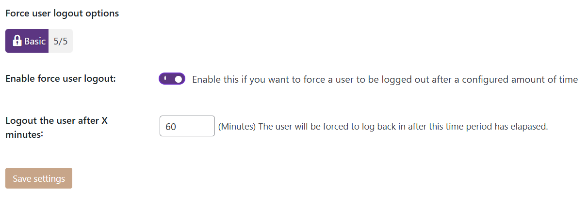

### 6.4 Filesystem Security — Permisiuni fișiere

Navigat la: **WP Security → File Security → Prevent hotlinks**

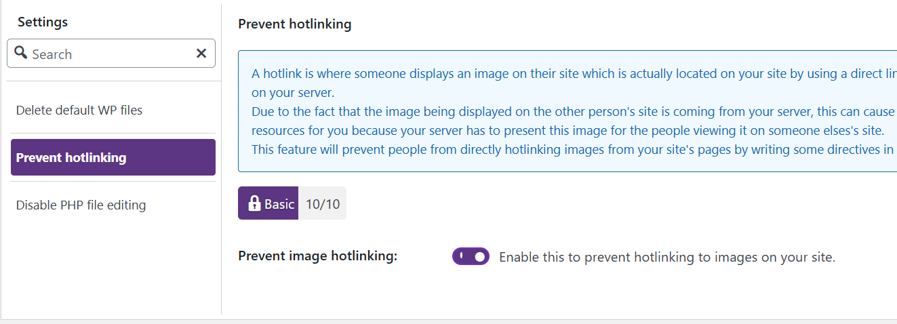


### 6.6 Firewall — Configurarea protecției de bază

Navigat la: **WP Security → Firewall**

| Opțiune | Status |
|---------|--------|
| Basic Firewall Rules | ✅ Activat |
| Disable Index Views | ✅ Activat |
| Disable Trace and Track | ✅ Activat |
| Block Bad Query Strings | ✅ Activat |

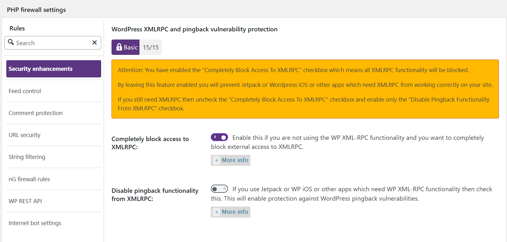

*Figura 13. Configurarea Firewall de bază în AIOS*

### 6.7 Brute Force — Schimbarea URL-ului de autentificare

Navigat la: **WP Security → Brute Force → Rename Login Page**

- **Pagina implicită:** `/wp-login.php`
- **Noul URL:** `/login-usm2025`

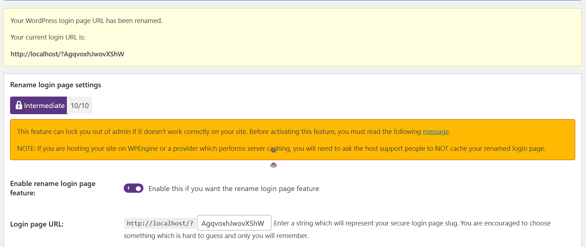

*Figura 14. Configurarea URL-ului personalizat pentru pagina de autentificare*

> ⚠️ **Important:** Noul URL a fost salvat imediat într-un manager de parole pentru a nu pierde accesul la panoul de administrare.

### 6.8 Scanner — Detectarea modificărilor de fișiere

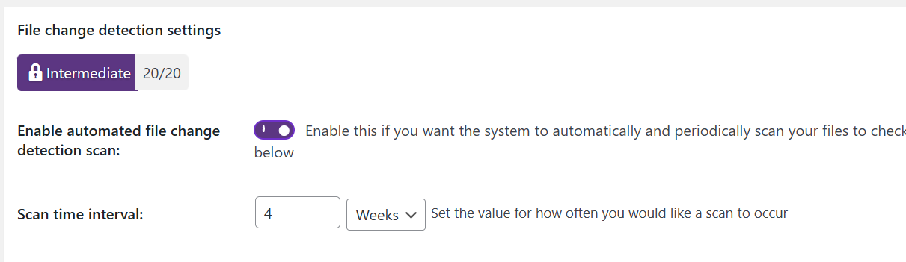

*Figura 15. Configurarea detecției automate a modificărilor de fișiere*

### 6.9 Backup — Copia de rezervă a bazei de date

A fost realizată manual o copie de rezervă prin **WP Security → Database Security → DB Backup → Create DB Backup Now**. Fișierul generat a fost descărcat și salvat în afara directorului rădăcină web.

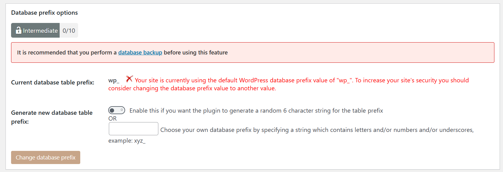

*Figura 16. Backup al bazei de date creat prin AIOS*

### 6.10 Scorul de securitate după toate configurările

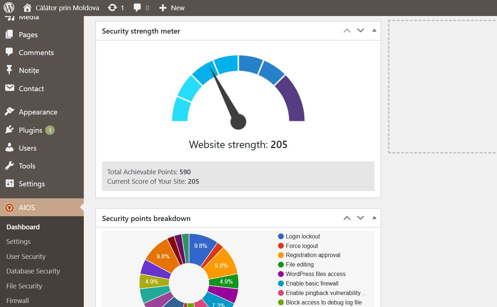

*Figura 17. Dashboard-ul AIOS cu scorul de securitate îmbunătățit după configurare*

---

## 7. Pasul 6 — Testarea protecției brute-force

### 7.1 Simularea atacului

Testul a fost realizat într-o fereastră privată (Incognito), accesând noul URL `http://localhost/login-usm2025` și introducând parole greșite de 6 ori consecutiv pentru utilizatorul `autor_test`.


### 7.2 Mesajul de blocare afișat

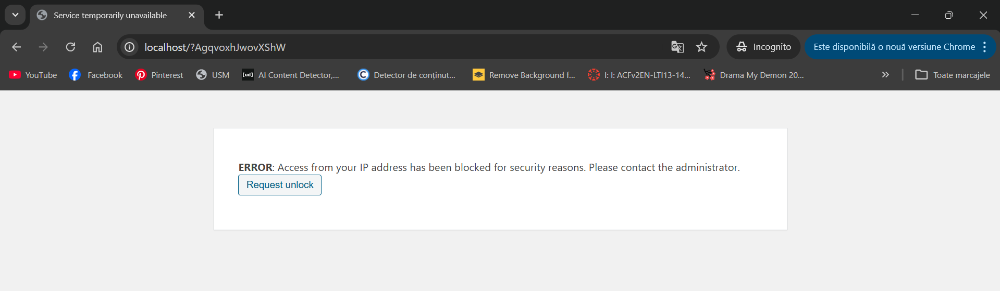

*Figura 19. Mesajul de blocare afișat după 5 încercări greșite consecutive*

### 7.3 Lista IP-urilor blocate în AIOS

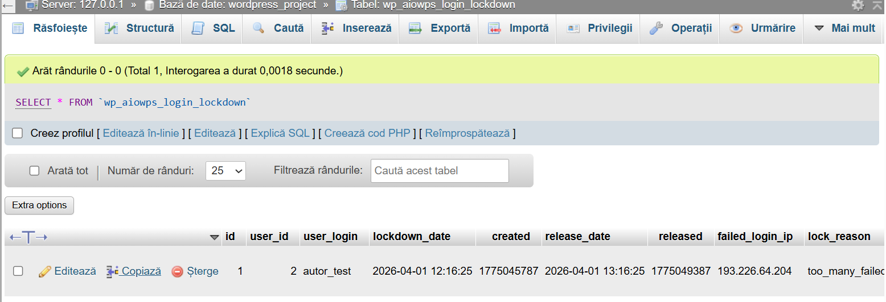

*Figura 20. Lista IP-urilor blocate în AIOS — IP-ul de test cu timestamp-ul blocării*

### 7.4 Deblocarea IP-ului de test

IP-ul blocat a fost deblocat manual din **WP Security → User Login → Login Lockdown → Currently Locked Out IP Addresses** prin butonul **Unlock** pentru a putea continua testele.

---

## 8. Pasul 7 — Restaurarea din backup

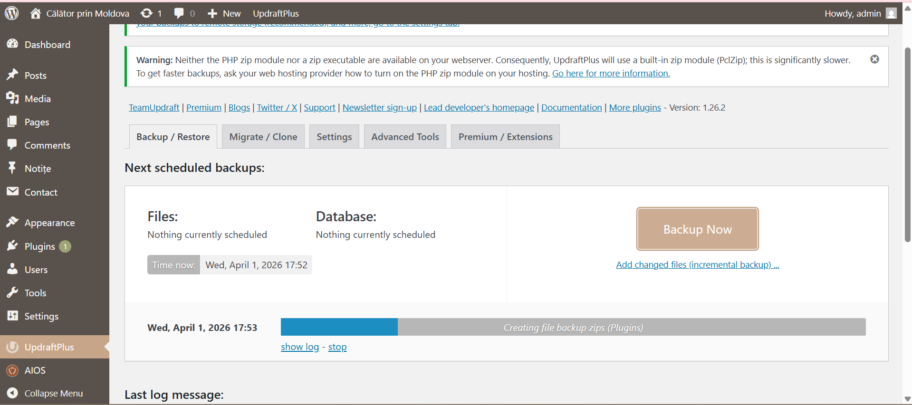

### 8.1 Ștergerea datelor de test

Au fost create și apoi șterse definitiv:
- O postare intitulată „Postare pentru testul de backup"
- O imagine în biblioteca media: `test_backup.png`

### 8.2 Restaurarea prin phpMyAdmin

S-a accesat `http://localhost/phpmyadmin`, s-a selectat baza de date WordPress, s-a navigat la fila **Import** și s-a încărcat fișierul `.sql.gz` exportat de AIOS.


*Figura 21. phpMyAdmin — importul bazei de date finalizat cu succes*

### 8.3 Verificarea datelor restaurate


*Figura 22. Postarea de test apare din nou în lista de articole după restaurare*


*Figura 23. Imaginea de test apare din nou în biblioteca media după restaurare*

> **Concluzie:** Restaurarea din backup a funcționat corect. Datele șterse au fost recuperate integral, confirmând că backup-ul era complet și funcțional.

> ⚠️ **Notă importantă:** Restaurarea bazei de date singure nu este suficientă. Fișierele media din `wp-content/uploads/` trebuie incluse separat. Un backup complet cuprinde **atât baza de date, cât și fișierele** site-ului.

---

## 9. Răspunsuri la întrebările de control

### Întrebarea 1
**De ce `DISALLOW_FILE_EDIT` și permisiunile corecte pe `wp-config.php` reduc semnificativ riscul post-exploit?**

**Răspuns:**

Termenul „post-exploit" se referă la acțiunile pe care un atacator le poate efectua **după** ce a obținut un prim punct de acces (de exemplu, după ce a spart parola unui cont de administrator sau a exploatat o vulnerabilitate dintr-un plugin).

**`DISALLOW_FILE_EDIT`** reduce riscul deoarece:
- Editorul intern WordPress permite modificarea directă a fișierelor PHP din teme și pluginuri prin browser, fără acces FTP sau SSH
- Dacă un atacator obține acces la contul de admin, primul lucru pe care îl va face este să insereze un **backdoor** în `footer.php` sau într-un plugin activ — cod care va rula automat la fiecare încărcare a paginii
- Cu `DISALLOW_FILE_EDIT = true`, editoarele dispar complet din interfață; chiar dacă atacatorul are acces de admin, nu poate modifica fișierele prin panoul web
- Atacatorul ar necesita acces FTP/SSH direct la server — un nivel mult mai ridicat de compromitere

**Permisiunile corecte pe `wp-config.php`** (`400`) reduc riscul deoarece:
- Chiar dacă un script malițios rulează pe server (ex. printr-un fișier PHP încărcat prin arbitrary file upload), nu poate **citi** `wp-config.php` pentru a extrage credențialele bazei de date
- Fără aceste credențiale, atacatorul nu poate accesa direct baza de date pentru a extrage parolele utilizatorilor sau a insera conturi noi de administrator

Împreună, aceste două măsuri implementează **apărarea în adâncime** (defense in depth): chiar dacă un strat de securitate este compromis, celelalte straturi limitează semnificativ daunele posibile.

---

### Întrebarea 2
**Ce setări ai ales pentru Login Lockdown/Firewall și de ce (explică echilibrul între securitate și experiența utilizatorului)?**

**Răspuns:**

**Pentru Login Lockdown:**

| Setare | Valoarea aleasă | Motivație |
|--------|----------------|-----------|
| Max Login Attempts | `5` | 3 ar bloca prea ușor utilizatori legitimi care greșesc parola; 5 este suficient pentru a opri atacurile automatizate |
| Retry Time Period | `15 min` | Acoperă un interval rezonabil fără a fi prea agresiv cu utilizatorii legitimi |
| Lockout Time | `30 min` | Descurajant pentru atacatori, dar nu blochează permanent un utilizator legitim |

O setare prea agresivă (ex. 3 încercări, blocare 24h) ar crea frustrare utilizatorilor legitimi care uită parola și ar putea fi exploatată pentru atacuri **DoS prin blocare** — un atacator poate bloca deliberat toți utilizatorii cunoscuți introducând parole greșite în numele lor. Mesajul generic de eroare (fără a preciza dacă utilizatorul sau parola e greșită) menține securitatea fără a compromite experiența utilizatorului.

**Pentru Firewall:**

S-a ales nivelul de bază (Basic Firewall) deoarece regulile avansate pot genera false positive, blocând cereri legitime și perturbând funcționalitatea. Opțiunile activate (block bad query strings, disable directory browsing, block XSS) oferă protecție reală împotriva amenințărilor comune fără efecte secundare pentru utilizatorii normali. Escaladarea la reguli mai stricte se face gradual, testând că nicio funcționalitate legitimă nu este afectată.

**Schimbarea URL-ului de login** este o măsură cu **impact zero asupra utilizatorilor legitimi** (cunosc noul URL) dar cu impact major asupra atacurilor automatizate care vizează `/wp-login.php` hardcodat în scripturile lor.

---

### Întrebarea 3
**Cu ce se deosebesc măsurile de protecție la nivel WordPress (plugin/WAF) față de cele la nivelul serverului web și al sistemului de operare?**

**Răspuns:**

Protecția unui site WordPress funcționează pe trei straturi distincte, fiecare cu caracteristici proprii:

**1. Nivel WordPress — Plugin/WAF aplicativ (ex. AIOS, Wordfence):**
- **Unde acționează:** La nivelul aplicației PHP, **după** ce cererea a trecut prin server și PHP a fost inițializat
- ✅ Ușor de configurat prin interfața grafică, fără cunoștințe de server; cunoaște contextul WordPress (utilizatori, roluri, conținut)
- ❌ Consumă resurse chiar și pentru a bloca o cerere; poate fi dezactivat dacă atacatorul accesează fișierele WordPress direct

**2. Nivel Server Web — Apache/Nginx (ex. reguli `.htaccess`, mod_security):**
- **Unde acționează:** La nivelul serverului web, **înainte** ca PHP să fie invocat
- ✅ Mai eficient — cererile malițioase sunt blocate fără a consuma resurse PHP; regulile `.htaccess` generate de AIOS pentru firewall acționează la acest nivel
- ❌ O greșeală în `.htaccess` poate face întregul site inaccesibil; necesită cunoștințe de configurare server

**3. Nivel Sistem de Operare/Infrastructură (ex. firewall de rețea, fail2ban):**
- **Unde acționează:** La nivelul rețelei sau al SO, **înainte** ca cererea să ajungă la serverul web
- ✅ Blochează traficul malițios fără a consuma nicio resursă a serverului; protejează și servicii non-HTTP (SSH, FTP, MySQL)
- ❌ Necesită acces root la server (indisponibil pe hosting partajat); configurare complexă

**Concluzie:** Cele mai eficiente configurații combină toate trei nivelurile. Un plugin WordPress este punctul de start accesibil, dar nu înlocuiește protecția la nivel de server și infrastructură.

---

### Întrebarea 4
**Ce trebuie inclus neapărat într-un backup „complet" WordPress și cum verifici dacă restaurarea funcționează cu adevărat?**

**Răspuns:**

**Componentele unui backup complet WordPress:**

Un backup complet trebuie să includă **două categorii principale de date**, fiecare indispensabilă:

**1. Baza de date MySQL/MariaDB** — conține:
- Articole, pagini, comentarii (`wp_posts`)
- Utilizatori și parole (`wp_users`)
- Setările site-ului și ale pluginurilor (`wp_options`)
- Categorii, etichete, metadate (`wp_terms`, `wp_postmeta`, etc.)

**2. Fișierele site-ului** — conțin:
- `wp-content/themes/` — temele instalate cu personalizările lor
- `wp-content/plugins/` — pluginurile instalate
- `wp-content/uploads/` — **toate imaginile și fișierele media** ← cel mai ușor de omis și cel mai greu de recuperat ulterior
- `wp-config.php` — configurația bazei de date și cheile de securitate
- `.htaccess` — regulile serverului, inclusiv cele generate de AIOS

> ⚠️ **Greșeala frecventă:** Backup doar al bazei de date. Fără `wp-content/uploads/`, imaginile articolelor sunt pierdute definitiv. Și invers — fișierele fără baza de date produc un site gol, fără conținut.

**Cum verifici că restaurarea funcționează cu adevărat:**

1. **Restaurare pe mediu separat** — niciodată direct pe site-ul live; se folosește un virtual host local sau un subdomeniu de test
2. **Import complet** — baza de date (prin phpMyAdmin sau CLI) + fișierele (prin FTP sau extragere arhivă)
3. **Verificări funcționale:**
   - ✅ Pagina principală se încarcă cu design intact
   - ✅ Articolele și paginile sunt prezente cu imagini
   - ✅ Autentificarea în `/wp-admin` funcționează
   - ✅ Biblioteca media conține toate fișierele
   - ✅ Pluginurile sunt active și configurate corect
4. **Simularea unui scenariu de dezastru** — se șterge deliberat o pagină sau o imagine, se restaurează și se verifică recuperarea (exact procedeul realizat în Pasul 7 al acestui laborator)

---

## 10. Concluzii

Lucrarea de laborator nr. 5 a demonstrat că securitatea unui site WordPress nu este un eveniment singular, ci un **proces continuu** care implică multiple straturi de protecție.

**Principalele lecții învățate:**

1. **Principiul celor mai mici privilegii** — fiecare utilizator primește doar drepturile strict necesare pentru activitatea sa; rolul „Autor" pentru colaboratori, nu „Administrator"
2. **Hardening-ul de bază** (`DISALLOW_FILE_EDIT`, permisiuni corecte, protejarea `wp-config.php`) elimină vectori de atac importanți cu efort minim
3. **Actualizările regulate** sunt cel mai eficient patch de securitate — vulnerabilitățile cunoscute în versiunile vechi sunt activ exploatate de atacatori
4. **AIOS** oferă un set complet de instrumente de securitate cu o interfață accesibilă, acoperind: protecția login-ului, firewall, detectarea modificărilor de fișiere și backup
5. **Backup-ul complet** (baza de date + fișiere) și **testarea periodică a restaurării** sunt ultima linie de apărare — orice site poate fi compromis, dar cu backup-uri bune daunele sunt reversibile
6. **Monitorizarea activității** prin alerte email și loguri permite detectarea rapidă a incidentelor și reacția înainte ca daunele să devină ireparabile

Securitatea nu înseamnă perfecțiune, ci **reducerea suprafeței de atac** și **capacitatea de a recupera rapid** după un incident.

---

*Raport realizat în cadrul cursului de Sisteme de Gestionare a Conținutului*  
*Lucrarea de Laborator Nr. 5 — Securitatea WordPress*
